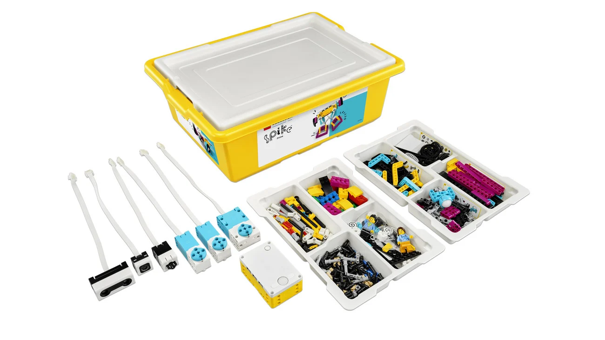
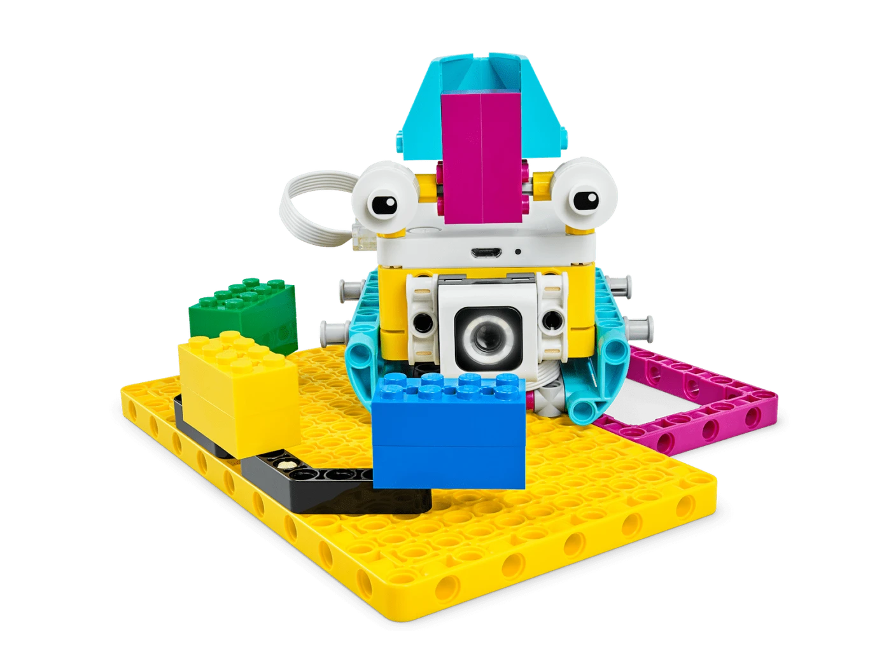
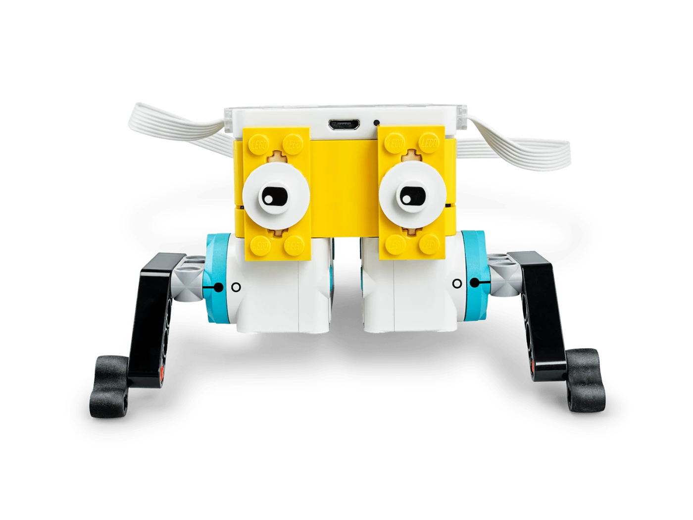
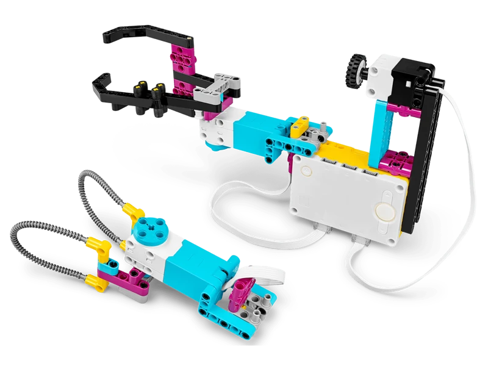
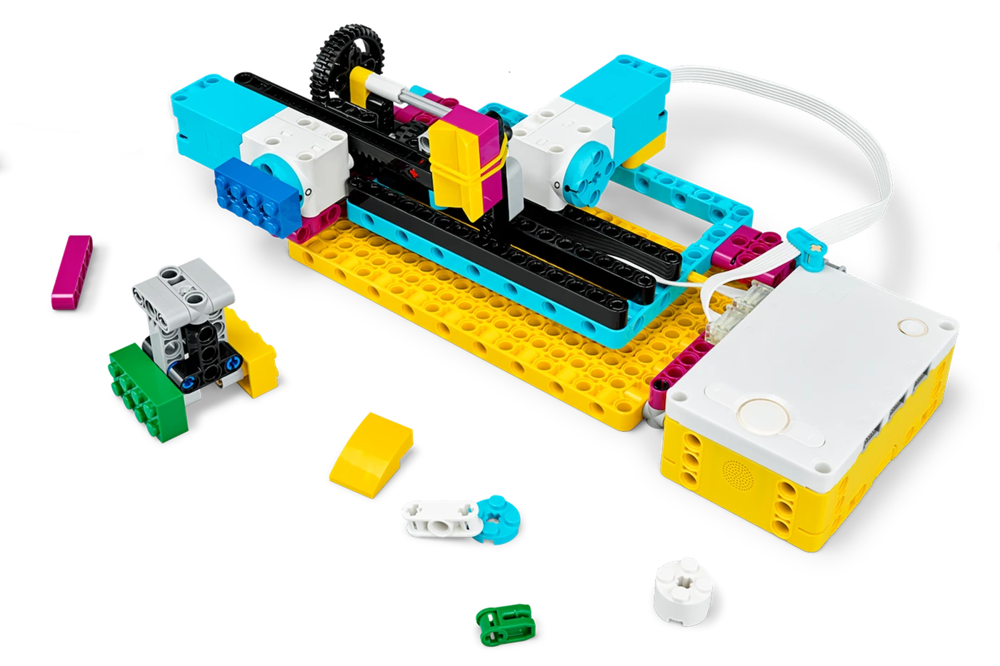
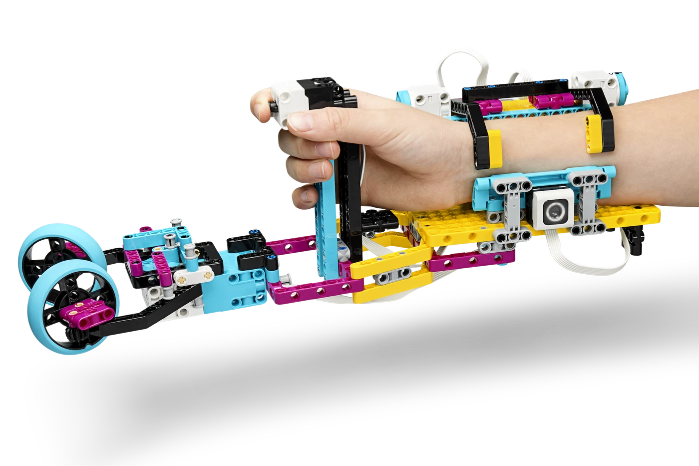

<!--
author: Jan Müller

titel: 9. Klasse Mittelstufenschule Themenfeld zur beruflichen Orientierung im Schwerpunkt Mechatronik.

icon: assets/BSO_LOGO_1.png

email:  Jan.Mueller4@schule.hessen.de

version:  0.0.1

language: Deutsch

narrator: Deutsch Female

comment: 

link:     https://cdn.jsdelivr.net/chartist.js/latest/chartist.min.css

script:   https://cdn.jsdelivr.net/chartist.js/latest/chartist.min.js

import: https://raw.githubusercontent.com/liaScript/mermaid_template/master/README.md

-->

# Mittelstufenschule Themenfeld zur beruflichen Orientierung im Schwerpunkt Mechatronik. 

>Die Lernenden **informieren** sich mittels Unterlagen und Dokumenten über den Ablauf und die Funktionsweise einfacher mechatronischer Systeme.

>Die Lernenden **planen** den Aufbau des einfachen mechatronischen Systems. Sie erarbeiten verschiedene einfache Arbeitsschritte zur Umsetzung des Aufbaus.

>Die Lernenden **entscheiden** anhand ihrer Planungen, die Auswahl verschiedener mechatronischer Komponenten und wählen die passenden Hilfsmittel zur Umsetzung aus.

>Die Lernenden **setzen** den geplanten Aufbau mithilfe der gewählten Hilfsmittel um und nutzen eine geeignete einfache Programmierung ein, um das mechatronische System in Betrieb zu nehmen.

>Die Lernenden **kontrollieren und bewerten** anhand der Funktionsweise, ob das mechatronische System die zugrundeliegenden Anforderungen erfüllt und korrigieren und optimieren auftretende Fehler und stellen ihre Arbeitsergebnisse vor.

## Lehrmittel

**Lego Spike Prime**



LEGO Education SPIKE Prime ist ein Bau- und Programmier-Set, mit dem du schnell eigene Roboter und smarte Geräte bauen kannst.

Im Mittelpunkt steht ein programmierbarer Hub mit Display, Lautsprecher und Bluetooth. Dazu kommen starke Motoren und verschiedene Sensoren, zum Beispiel für Farbe, Abstand und Kraft. Du kannst die Roboter einfach per Drag-and-drop programmieren oder mit Python. So lernst du praxisnah Mechanik, Elektronik, Algorithmen und vor allem, wie man Fehler findet und behebt.

Typische Projekte sind zum Beispiel ein selbstfahrendes Auto, ein Sortierroboter oder ein Greifarm. Das Set eignet sich besonders gut für den MINT-Unterricht, Arbeitsgemeinschaften oder Wettbewerbe. Der Fokus liegt darauf, Dinge auszuprobieren, schnell Prototypen zu bauen und im Team Probleme zu lösen.

**Kurzcheck:**

* Baue echte Roboter in wenigen Minuten  
* Programmiere visuell oder mit Python  
* Nutze Motoren und Sensoren für smarte Funktionen  
* Fördert Kreativität, logisches Denken und Teamarbeit


## Ablauf

```@mermaid
gantt
    dateFormat YYYY-MM-DDg
    axisFormat %W
    tickInterval 1week
    weekday monday
        section Einführung
        1.Termin Organisation    :2025-08-25, 1d
        2.Termin Erste Schritte Lego Spike    :2025-09-01, 1d
        section Beobachten, Problem definieren, Prototypen testen
        3.Termin     :2025-09-08, 1d
        4.Termin     :2025-09-15, 1d
        5.Termin     :2025-09-22, 1d
        section Unternehmensgründung
        6.Termin     :2025-09-29, 1d
        7.Termin     :2025-10-20, 1d
        8.Termin     :2025-10-27, 1d
        9.Termin     :2025-11-03, 1d
        section Alltagshelfer
        10.Termin    :2025-11-10, 1d
        11.Termin    :2025-11-17, 1d
        12.Termin    :2025-11-24, 1d
        13.Termin    :2025-12-01, 1d
        section Wettbewerbsvorbereitung
        14.Termin    :2025-12-08, 1d
        15.Termin    :2025-12-15, 1d
        16.Termin    :2026-01-12, 1d
        17.Termin    :2026-01-19, 1d
        18.Termin    :2026-01-26, 1d
```
## Beobachten, Problem definieren, Prototypen testen

```@mermaid
timeline
          Beobachten, Problem definieren, Prototypen testen.
          : S1 Hilfe!
          : S2 Hüpfer-Rennen
          : S3 Aufräumhilfe
          : S4 Kaputt
          : S5 Etwas für eine andere Person Entwickeln
          : Die Lernenden können können Problem und Erfolgskriterien bestimmen, Prototyping nutzen, zwei Konstruktionen kriterienbasiert testen und die beste Lösung begründet empfehlen.

          Kompetenz <br> Datenbasierte Konstruktion
          : Die Lernenden können technische Lösungen datenbasiert konstruieren und optimieren. Sie können Problem und Erfolgskriterien definieren und Prototypen entwickeln.
```

### S1 Hilfe!

 {{0-1}}
<section>



[Hilfe! - Arbeitsblatt](https://education.lego.com/de-de/lessons/prime-invention-squad/help/student-worksheet/)

</section>

{{1-2}}
<section>

**Impulsfragen:**

Hat einer von euch ein Haustier, wenn ja welches?

[[___ _____ _____ ]]

Wie macht sich dein Haustier bemerkbar, wenn es Bedürfnisse hat?

[[___ _____ _____ ]]

</section>

{{2-3}}
<section>

**Arbeitsauftrag:**

1. Öffne folgenden [Link](https://spike.legoeducation.com/prime/unit-plans/bltdfae10d779620d2b)!
2. Wähle die Aufgabe **01 Hilfe!** aus.
3. Bearbeite die Aufgabe mit deiner Partnerin oder deinem Partner.
4. Beantwortet dabei folgende Fragen:

     a) Schreibe hier die erste Geschichte auf:

        [[___ _____ _____ ]]


     b) Schreibe hier die zweite Geschichte auf: 

        [[___ _____ _____ ]] 

</section>

{{3-4}}
<section>

**Auswertung**

Wie war eure Arbeitsleitung?

    [(mangelhaft)(ausreichend)(gut)(sehr gut)]
    [                                        ] Qualität
    [                                        ] Selbständigkeit
    [                                        ] Tempo
    [                                        ] Motivation
    [                                        ] Teamarbeit

Was ist euch bei der Aufgabe aufgefallen?

[[___ _____ _____ ]]

</section>

### S2 Hüpfer-Rennen

{{0-1}}
<section>



[Hüpfer-Rennen - Arbeitsblatt](https://education.lego.com/de-de/lessons/prime-invention-squad/hopper-race/student-worksheet/)

</section>

{{1-2}} 

<section>

**Impulsfragen:**

Was ist ein Prototyp?

[[___ _____ _____ ]]

Habt ihr schon einmal eine Idee in einen Prototypen umgesetzt? Wie habt ihr das gemacht?

[[___ _____ _____ ]]

</section>

{{2-3}} 

<section>

**Arbeitsauftrag:**

1. Öffne folgenden [Link](https://spike.legoeducation.com/prime/unit-plans/bltdfae10d779620d2b)!
2. Wähle die Aufgabe **02 Hüpfer-Rennen** aus.
3. Bearbeite die Aufgabe mit deiner Partnerin oder deinem Partner.
4. Beantwortet dabei folgende Fragen:

     a) Welcher Prototyp war am schnellsten und warum?

        [[___ _____ _____ ]]


     b) Wie kam euch die Idee zu euren Prototypen?

        [[___ _____ _____ ]]

</section>

{{3-4}}

<section>

**Auswertung**

Wie war eure Arbeitsleistung?

    [(mangelhaft)(ausreichend)(gut)(sehr gut)]
    [                                        ] Qualität
    [                                        ] Selbständigkeit
    [                                        ] Tempo
    [                                        ] Motivation
    [                                        ] Teamarbeit

Was ist euch bei der Aufgabe aufgefallen?

[[___ _____ _____ ]]

</section>


### S3 Aufräumhilfe

{{0-1}}

<section>



[Super-Aufräumhilfe – Arbeitsblatt](https://education.lego.com/de-de/lessons/prime-invention-squad/super-cleanup/student-worksheet/)

</section>

{{1-2}} 
<section>

**Impulsfragen:**

Warum verwendet man Greifer, um Müll aufzuheben?

[[___ _____ _____ ]]

Wie kann man herauszufinden, welcher Greifer der beste ist?

[[___ _____ _____ ]]

Habt ihr euch im Internet schon einmal Produktbesprechungen angesehen?

[[___ _____ _____ ]]

</section>

{{2-3}}

<section>

**Arbeitsauftrag:**

1. Öffne folgenden [Link](https://spike.legoeducation.com/prime/unit-plans/bltdfae10d779620d2b)!
2. Wähle die Aufgabe **03 Aufräumhilfe** aus.
3. Bearbeite die Aufgabe mit deiner Partnerin oder deinem Partner.
4.  Beantwortet dabei folgende Fragen:

     a) Test Nr. 1: Größe

[[Greifer schwarz][Greifer grau]]
[                               ] Flasche?
[                               ] Papier?
[                               ] LEGO Stein?

     b) Test Nr. 2: Gewicht

[[Greifer schwarz][Greifer grau]]
[                               ] LEGO Räder?
[                               ] Papier?
[                               ] Apfel?


Welcher Greifer eignet sich am besten für kleine Gegenstände?

[[___]]

Welcher Greifer eignet sich am besten für schwere Gegenstände?

[[___]]

</section>

{{3-4}}

<section>

**Auswertung**

Wie war eure Arbeitsleistung?

    [(mangelhaft)(ausreichend)(gut)(sehr gut)]
    [                                        ] Qualität
    [                                        ] Selbständigkeit
    [                                        ] Tempo
    [                                        ] Motivation
    [                                        ] Teamarbeit

Was ist euch bei der Aufgabe aufgefallen?

[[___ _____ _____ ]]

</section>

### S4 Kaputt

{{0-1}}
<section>



[Kaputt-Arbeitsblatt](https://education.lego.com/de-de/lessons/prime-invention-squad/broken/student-worksheet/)

</section>

{{1-2}} 
<section>

**Impulsfragen:**

Was ist normalerweise eure erste Reaktion, wenn etwas kaputtgeht?

[[___ _____ _____ ]]

Wenn ihr etwas reparieren wollt, was tut ihr zuerst?

[[___ _____ _____ ]]

Was ist eine CNC-Maschine?

[[___ _____ _____ ]]

</section>

{{2-3}}
<section>

**Arbeitsauftrag:**

1. Öffne folgenden [Link](https://spike.legoeducation.com/prime/unit-plans/bltdfae10d779620d2b)!
2. Wähle die Aufgabe **04 Kaputt** aus.
3. Bearbeite die Aufgabe mit deiner Partnerin oder deinem Partner.
4. Beantwortet dabei folgende Fragen:

     a) Beschreibt was ihr seht, Sucht nach dem Problem?

     [[___ _____ _____ ]]


     b) Was sind die Probleme?

     [[___ _____ _____ ]]

     c) Wie habt ihr die Probleme gelöst?

     [[___ _____ _____ ]]

     d) Eure Anleitung zur Fehlersuche und -behebung:

     [[___ _____ _____ ]]

</section>

{{3-4}}
<section>

**Auswertung**

Wie war eure Arbeitsleistung?

    [(mangelhaft)(ausreichend)(gut)(sehr gut)]
    [                                        ] Qualität
    [                                        ] Selbständigkeit
    [                                        ] Tempo
    [                                        ] Motivation
    [                                        ] Teamarbeit

Was ist euch bei der Aufgabe aufgefallen?

[[___ _____ _____ ]]

</section>

### S5 Etwas für eine andere Person Entwickeln

{{0-1}}
<section>



[Etwas für andere Personen Entwickeln- Arbeitsblatt](https://education.lego.com/de-de/lessons/prime-invention-squad/design-for-someone/student-worksheet/)

</section>

{{1-2}} 
<section>

**Impulsfragen:**

Was ist nötig, damit man etwas für eine andere Person entwickeln kann?

[[___ _____ _____ ]]

Wenn ihr die Hand einer Person durch etwas ersetzen müsstet, was wäre das? Was würde dieser Gegenstand können?

[[___ _____ _____ ]]

</section>

{{2-3}}
<section>

**Arbeitsauftrag:**

1. Öffne folgenden [Link](https://spike.legoeducation.com/prime/unit-plans/bltdfae10d779620d2b)!
2. Wähle die Aufgabe **05 Etwas für eine andere Person Entwickeln** aus.
3. Bearbeite die Aufgabe mit deiner Partnerin oder deinem Partner.
4. Beantwortet dabei folgende Fragen:

     a) Nennt zwei Ideen die eine Hand ersetzten könnten?

     [[___ _____ _____ ]]


     b) Wie könnt ihr Testen ob eure Ideen funktionieren?

     [[___ _____ _____ ]]

     c)Beschreibt, was euer Prototyp gut kann (oder nicht so gut kann). Beurteilt, ob er wirklich das tut, was ihr euch vorgestellt habt. 

     [[___ _____ _____ ]]


</section>

{{3-4}}
<section>

**Auswertung**

Wie war eure Arbeitsleistung?

    [(mangelhaft)(ausreichend)(gut)(sehr gut)]
    [                                        ] Qualität
    [                                        ] Selbständigkeit
    [                                        ] Tempo
    [                                        ] Motivation
    [                                        ] Teamarbeit

Was ist euch bei der Aufgabe aufgefallen?

[[___ _____ _____ ]]

</section>
